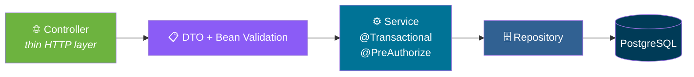

# 📦 WarehouseOS

<div align="center">


**A warehouse and inventory management system built around inventory correctness.**

*Every stock change is transactional, row-locked, and recorded in an append-only ledger.*

[🏛️ Overview](#-overview) • [🏗️ Architecture](#-architecture) • [🚀 Setup](#-docker-setup) • [📡 API](#-implemented-endpoints) • [🗺️ Roadmap](#-roadmap)

</div>

---

## 📖 Overview

**WarehouseOS** manages products, warehouses, bin locations, stock levels, and the movements between them.

The design goal is simple and absolute:

> **No code path — and no manual `psql` session — can leave inventory in an inconsistent state.**

### Three Defensive Layers

<div align="center">

| 1. 🎯 Domain Methods | 2. 🗄️ Database Constraints |
|:---:|:---:|
| `Inventory` has **no public quantity setters** used by business code. Callers must go through `reserve`, `releaseReservation`, `consumeReservation`, `increaseOnHand`, `decreaseOnHand` | `CHECK (reserved_quantity <= quantity_on_hand)` and non-negative checks on **every** quantity column |
| **3. 🔒 Row Locks** | **4. 📜 Append-Only Ledger** |
| Mutating paths load inventory with `SELECT ... FOR UPDATE` — with a **5s lock timeout** — so concurrent reservations **serialise rather than race** | `stock_movements` and `audit_logs` are **append-only**, enforced by a PostgreSQL trigger that raises on `UPDATE` and `DELETE` |

</div>

> ⚠️ **Status: Phase 1 complete, Phase 2 in progress.**
>
> See [Roadmap](#-roadmap) for exactly what is and is not implemented. **Nothing in this repository is stubbed or mocked** — features that are not listed as done simply are not there yet.

---

## 🏗️ Architecture

### Request Flow



### Design Principles

- **JPA entities never cross the HTTP boundary** — every endpoint speaks in **DTOs**
- **Business rules live in services**, not controllers
- **Hibernate runs with `ddl-auto: validate`** — a mismatch between entities and schema fails fast at boot rather than corrupting data later

### Project Layout

```
backend/src/main/java/com/warehouseos/
├── config/          AppProperties, OpenAPI
├── security/        JWT filter, SecurityConfig, principal, entry point
├── controller/      thin HTTP layer
├── service/         business logic and transactions
├── repository/      Spring Data + locking queries
├── entity/          JPA model
├── dto/             request/response records
├── mapper/          entity → DTO
├── exception/       error codes, ApiError, global handler
├── specification/   Criteria API predicates for search
└── seed/            development-only data loader
```

### Technology Stack

| Layer | Technology |
|-------|-----------|
| **Language** | Java 21 |
| **Framework** | Spring Boot 3.3 |
| **Modules** | Spring Web · Data JPA · Security |
| **Database** | PostgreSQL 16 |
| **Migrations** | Flyway |
| **Auth** | JWT (jjwt) |
| **Utilities** | Lombok · springdoc-openapi |
| **Testing** | JUnit 5 · Testcontainers |
| **Infra** | Docker Compose |

---

## 🗄️ Database Schema

The full schema ships in a single migration:

```
backend/src/main/resources/db/migration/V1__core_schema.sql
```

It covers **identity, catalogue, locations, inventory, inbound, transfers, counting, picking, notifications, and audit**.

> 💡 **Later phases add behavior, not new tables.**

### Design Details Worth Knowing

<div align="center">

| Detail | Why |
|--------|-----|
| **`inventory` uses two partial unique indexes** instead of one constraint | PostgreSQL treats `NULL` location as **distinct** — without this, you can silently create **duplicate stock rows** for unlocated inventory |
| **`refresh_tokens` stores a SHA-256 hash** | Never the token itself |
| **`stock_transfers` has a `CHECK`** that source and destination differ | Prevents self-transfers |
| **`purchase_order_items` has a `CHECK`** preventing over-receipt | Inventory can't be inflated by a bad PO |

</div>

---

## 🔧 Environment Variables

| Variable | Purpose | Default |
|----------|---------|---------|
| `DATABASE_URL` | JDBC URL | `jdbc:postgresql://localhost:5432/warehouseos` |
| `DATABASE_USERNAME` | DB user | `warehouseos` |
| `DATABASE_PASSWORD` | DB password | `warehouseos` |
| `JWT_SECRET` | Base64, **≥32 bytes** | dev fallback *(**override in deployment**)* |
| `JWT_ACCESS_TTL` | Access token lifetime (ISO-8601) | `PT15M` |
| `JWT_REFRESH_TTL` | Refresh token lifetime | `P7D` |
| `SEED_ENABLED` | Load development seed data | `true` |
| `CORS_ALLOWED_ORIGINS` | Comma-separated origins | `http://localhost:5173` |

---

## 🚀 Docker Setup

```bash
cp .env.example .env
openssl rand -base64 48        # paste into JWT_SECRET
docker compose up --build
```

| Service | URL |
|---------|-----|
| **API** | http://localhost:8080 |
| **Swagger UI** | http://localhost:8080/swagger-ui.html |

---

## 🛠️ Local Development

```bash
docker compose up -d postgres
cd backend
JWT_SECRET=$(openssl rand -base64 48) ./mvnw spring-boot:run
```

> 💡 **Flyway applies migrations on startup.**
>
> **Hibernate runs with `ddl-auto: validate`** — so a mismatch between entities and schema **fails fast at boot** rather than corrupting data later.

---

## 🧪 Test Commands

```bash
cd backend
./mvnw test                                  # unit + integration
./mvnw test -Dtest=AuthFlowIntegrationTest   # single class
```

> 💡 **Integration tests start a real PostgreSQL container via Testcontainers** — because the invariants being tested are database-level.
>
> **Docker must be running.**

---

## 🔑 Development Credentials

> ⚠️ **Development only.** Created by `DevDataSeeder` and skipped when `SEED_ENABLED=false`.
>
> **Never deploy with these present.**

| Username | Role | Password |
|----------|------|----------|
| `admin` | ADMIN | `Warehouse123!` |
| `manager` | MANAGER | `Warehouse123!` |
| `staff` | STAFF | `Warehouse123!` |

### Seed Data

The seeder also includes:

- **2 warehouses**
- **13 bin locations**
- **3 categories**
- **2 suppliers**
- **22 products** — with stock **deliberately spread** across in-stock, low-stock, and out-of-stock states, so dashboards have something real to show

---

## 📡 API Documentation

**Interactive docs:** `/swagger-ui.html`
**OpenAPI document:** `/v3/api-docs`

> 💡 Click **Authorize** and paste an access token from `POST /api/auth/login`.

### Implemented Endpoints

#### 🔐 Authentication

```
POST   /api/auth/register          public — always creates a STAFF account
POST   /api/auth/login             public
POST   /api/auth/refresh           public — rotates the refresh token
POST   /api/auth/logout            revokes all refresh tokens
GET    /api/auth/me
```

#### 📦 Products

```
GET    /api/products               ?q=&categoryId=&brand=&active=&page=&size=&sort=
GET    /api/products/{id}
GET    /api/products/sku/{sku}
GET    /api/products/barcode/{barcode}
POST   /api/products               ADMIN, MANAGER
PUT    /api/products/{id}          ADMIN, MANAGER
DELETE /api/products/{id}          ADMIN, MANAGER — deactivates, never deletes
POST   /api/products/{id}/activate ADMIN, MANAGER
```

#### 🏢 Warehouses

```
GET    /api/warehouses
GET    /api/warehouses/{id}
POST   /api/warehouses             ADMIN
PUT    /api/warehouses/{id}        ADMIN
PATCH  /api/warehouses/{id}/status ADMIN
```

### Error Format

Every failure — **validation, auth, business rule, lock conflict** — returns the same shape:

```json
{
  "timestamp": "2026-02-14T09:31:22.104Z",
  "status": 409,
  "error": "INSUFFICIENT_STOCK",
  "message": "Not enough stock available for LAPTOP-001: requested 5, available 2",
  "path": "/api/transfers",
  "details": { "sku": "LAPTOP-001", "requested": 5, "available": 2 }
}
```

---

## 💡 Example Workflows

### Log In and List Low-Stock Candidates

```bash
TOKEN=$(curl -s -X POST localhost:8080/api/auth/login \
  -H 'Content-Type: application/json' \
  -d '{"username":"manager","password":"Warehouse123!"}' | jq -r .accessToken)

curl -s localhost:8080/api/products?q=laptop \
  -H "Authorization: Bearer $TOKEN" | jq
```

### Role Enforcement Is Server-Side

```bash
STAFF=$(curl -s -X POST localhost:8080/api/auth/login \
  -H 'Content-Type: application/json' \
  -d '{"username":"staff","password":"Warehouse123!"}' | jq -r .accessToken)

curl -s -X POST localhost:8080/api/warehouses \
  -H "Authorization: Bearer $STAFF" \
  -H 'Content-Type: application/json' \
  -d '{"code":"WH-009","name":"Nope"}'
# → 403 ACCESS_DENIED
```

---

## 🔐 Security Notes

<div align="center">

| Protection | Implementation |
|-----------|---------------|
| **Password hashing** | BCrypt, strength 12 |
| **No password leakage** | Password hashes are absent from every DTO **by construction, not by annotation** |
| **Login failure hygiene** | Logged without the attempted password; returns an **identical message** whether the user exists or not |
| **Refresh token rotation** | Rotates on use; **replaying a consumed token revokes the entire token family** for that user — the standard response to suspected theft |
| **Role freshness** | Roles are **re-read from the database on each request** rather than trusted from the JWT — so **revoking a role takes effect immediately** |
| **Registration safety** | Self-registration **cannot** produce a privileged account |
| **CSRF** | **Disabled deliberately** — the API is stateless and authenticated by a bearer token that browsers do not attach automatically |

</div>

---

## 🗺️ Roadmap

| Phase | Scope | Status |
|:-----:|-------|:------:|
| **1** | Boot, PostgreSQL, Flyway, JWT auth, users/roles, error handling, Docker | ✅ **Done** |
| **2** | Products, categories, warehouses, locations | 🟡 Products + warehouses done; categories, locations, suppliers pending |
| **3** | Inventory service, stock movements, goods receiving | 🟡 Schema + entities + locking queries in place; services pending |
| **4** | Transfers, reservations, concurrency tests | ⏭️ Pending |
| **5** | Purchase orders, counting, picking | ⏭️ Pending |
| **6** | Dashboard, reports, notifications, audit logs | ⏭️ Pending |
| **7** | React frontend, full test suite | ⏭️ Pending |

---

## ⚠️ Known Gaps

<div align="center">

| Gap | What to Do |
|-----|-----------|
| **Backend has not been compiled** in the authoring environment | No Maven registry access during authoring — run `./mvnw clean verify` first |
| **No Maven wrapper committed** | Use a local `mvn` or generate one with `mvn wrapper:wrapper` |
| **`frontend/` module not started** | Arrives with Phase 7 |

</div>

---

## 🤝 Contributing

Contributions are welcome. Please:

1. Fork the repository
2. **Never bypass the domain methods** — all stock changes go through `reserve`, `releaseReservation`, `consumeReservation`, `increaseOnHand`, `decreaseOnHand`
3. **Always row-lock mutating paths** — use `findByIdForUpdate`
4. **Add migrations, don't alter existing ones** — Flyway is the schema history
5. **Never expose entities over HTTP** — always map to DTOs
6. **Add tests for anything database-level** — Testcontainers, not mocks
7. Submit a Pull Request

### Guidelines

- **Never add a public quantity setter to `Inventory`**
- **Never trust a JWT's role claim** — re-read from the database
- **Never return a password hash** — and never store a raw refresh token
- **Never allow `UPDATE` or `DELETE` on `stock_movements` or `audit_logs`**
- **Never commit a real `JWT_SECRET`** — generate with `openssl rand -base64 48`

---

## 📜 License

MIT — see [LICENSE](LICENSE) for details.

---

## 🙏 Acknowledgments

- **PostgreSQL's `SELECT ... FOR UPDATE`** — for making correct concurrency boring
- **Flyway** — for making schema history a first-class artifact
- **Testcontainers** — for making integration tests honest
- **Every inventory system that's ever lost a pallet** — this one won't

---

<div align="center">

### 📦 COUNT. MOVE. TRACK. TRUST.

**Every stock change is transactional, row-locked, and recorded.**

**No code path — and no manual `psql` session — can leave inventory inconsistent.**

<br>

⭐ If this project helped you, consider giving it a star.

<br>

[⬆ Back to Top](#-warehouseos)

</div>
